# Engine Style Templates

Always prepend or configure your generated diagram DSL files with these exact aesthetic templates to ensure consistent, premium styling across all engines.

> **Font limitation**: Templated engines that render server-side (PlantUML, C4-PlantUML, Mermaid, Graphviz, ERD) can only use fonts installed on the Kroki server. The design system mandates Geist Sans/Mono and Instrument Serif, but Kroki instances typically only have system fonts available. Templates default to Helvetica as the closest sans-serif fallback. When viewing in the interactive HTML viewer, browser-loaded web fonts display correctly — but standalone SVG/PNG/PDF outputs render with server fonts only.

---

## 1. D2 (Modern Architecture Default)

D2 naturally outputs gorgeous clean shapes. Configure the global layout styles:

```d2
direction: down

# Global visual presets
classes: {
  focal: {
    style.fill: "#fdece5"
    style.stroke: "#eb6c36"
    style.stroke-width: 2
  }
  external: {
    style.fill: "#f0f0f2"
    style.stroke: "#c0c2c7"
  }
}

grid.style.stroke: "rgba(45, 49, 66, 0.12)"
grid.style.fill: "#f5f5f5"

# Nodes default styling (D2 uses font-color and font-size, not font)
*.style.font-color: "#2d3142"
*.style.font-size: 13
*.style.fill: "#ffffff"
*.style.stroke: "#2d3142"
*.style.border-radius: 6

# Connection defaults
*.style.stroke-width: 1
*.style.stroke: "#4f5d75"
```

> **D2 diagram options**: Pass `--diagram-option theme=earth-tones` (or any D2 theme ID) and `--diagram-option layout=elk` for ELK layout. Sketch mode: `--diagram-option sketch=`. See `kroki-safe-subset.md` for the full options list.

---

## 2. PlantUML (Minimal Editorial Theme)

Wrap your PlantUML code with this style block to enforce the warm paper background, jet black ink, and sans-serif node typography.

```plantuml
@startuml
<style>
root {
  FontName "Helvetica"
  FontSize 13
  BackgroundColor #f5f5f5
  LineColor #2d3142
}
title {
  FontName "Georgia"
  FontSize 16
  FontStyle bold
  FontColor #2d3142
}
arrow {
  LineColor #4f5d75
  FontColor #4f5d75
  FontSize 10
}
actor {
  BackGroundColor #eb6c36
  LineColor #eb6c36
  FontColor #FFFFFF
}
participant {
  BackGroundColor #FFFFFF
  LineColor #2d3142
  FontColor #2d3142
}
database {
  BackGroundColor #ffffff
  LineColor #4f5d75
  FontColor #2d3142
}
note {
  BackGroundColor #ececec
  LineColor #bfc0c0
  FontColor #2d3142
}
</style>
...
@enduml
```

> **Kroki version note**: The `<style>` block below requires PlantUML ≥ 1.2020.x (supported on Kroki ≥ 0.19). If you target an older self-hosted Kroki instance, replace the `<style>` block with equivalent `skinparam` directives (e.g. `skinparam BackgroundColor #f5f5f5`, `skinparam ArrowColor #4f5d75`).



---

## 3. C4-PlantUML

Use elegant container styles that steer clear of default bright corporate blues.

> **Self-hosted Kroki — stdlib include**: The public `kroki.io` instance bundles the C4-PlantUML stdlib locally, so `!include <C4Container>` works out of the box. Self-hosted Kroki running in the default `SECURE` mode blocks all remote URL fetches, which means the raw GitHub URL form will silently fail with a 400/500 error.
>
> **Use the local stdlib form (recommended for all environments):**
>
> ```plantuml
> !include <C4Container>
> ```
>
> **Avoid the remote URL form** (breaks on self-hosted SECURE mode):
>
> ```plantuml
> !include https://raw.githubusercontent.com/plantuml-stdlib/C4-PlantUML/master/C4_Container.puml
> ```
>
> If you are running self-hosted Kroki with `KROKI_SAFE_MODE=unsafe` and need the URL form, confirm your Kroki configuration explicitly allows remote includes via `KROKI_PLANTUML_ALLOW_INCLUDE=true`.

```plantuml
@startuml
!include <C4Container>

UpdateElementStyle("person", $bgColor="#eb6c36", $fontColor="#FFFFFF", $borderColor="#eb6c36")
UpdateElementStyle("external_person", $bgColor="#7a8399", $fontColor="#FFFFFF", $borderColor="#4f5d75")
UpdateElementStyle("system", $bgColor="#2e5aa8", $fontColor="#FFFFFF", $borderColor="#2e5aa8")
UpdateElementStyle("external_system", $bgColor="#bfc0c0", $fontColor="#2d3142", $borderColor="#7a8399")
UpdateElementStyle("container", $bgColor="#ffffff", $fontColor="#2d3142", $borderColor="#2d3142")
UpdateElementStyle("database", $bgColor="#ffffff", $fontColor="#2d3142", $borderColor="#eb6c36")
UpdateBoundaryStyle($bgColor="#ececec", $fontColor="#2d3142", $borderColor="#bfc0c0")
UpdateRelStyle($lineColor="#4f5d75", $textColor="#4f5d75")
...
@enduml
```

---

## 4. Mermaid (Warm Editorial Theme)

Inject variables into the init block at the very top of your `.mmd` script:

```mermaid
%%{init: {
  'theme': 'base',
  'themeVariables': {
    'background': '#f5f5f5',
    'primaryColor': '#ffffff',
    'primaryTextColor': '#2d3142',
    'primaryBorderColor': '#2d3142',
    'secondaryColor': '#ececec',
    'secondaryTextColor': '#2d3142',
    'secondaryBorderColor': '#bfc0c0',
    'tertiaryColor': 'rgba(235, 108, 54, 0.08)',
    'tertiaryTextColor': '#eb6c36',
    'tertiaryBorderColor': '#eb6c36',
    'lineColor': '#4f5d75',
    'fontFamily': 'Helvetica, sans-serif',
    'fontSize': '13px'
  }
}}%%
flowchart TD
  ...
```



---

## 5. Graphviz (Clean Editorial Layout)

Set `graph`, `node`, and `edge` defaults to maintain professional balance:

```dot
digraph G {
  graph [
    bgcolor="#f5f5f5",
    fontname="Helvetica",
    fontsize=13,
    pad=0.5,
    rankdir=TB,
    ranksep=1.2,
    nodesep=0.8,
    splines=ortho,
    overlap=false
  ]

  node [
    shape=box,
    style="filled,rounded",
    fillcolor="#ffffff",
    color="#2d3142",
    fontname="Helvetica",
    fontsize=12,
    fontcolor="#2d3142",
    margin="0.18,0.10"
  ]

  edge [
    color="#4f5d75",
    fontname="Helvetica",
    fontsize=10,
    fontcolor="#4f5d75",
    arrowsize=0.8
  ]
  ...
}
```

---

## 6. BPMN (Business Process)

BPMN diagrams rendered via Kroki use a fixed renderer with no styling API. Design tokens cannot be applied.

```xml
<?xml version="1.0" encoding="UTF-8"?>
<definitions xmlns="http://www.omg.org/spec/BPMN/20100524/MODEL"
             targetNamespace="http://bpmn.io/schema/bpmn">
  <process id="process1" isExecutable="false">
    <startEvent id="start"/>
    <task id="task1" name="Task Name"/>
    <endEvent id="end"/>
    <sequenceFlow id="flow1" sourceRef="start" targetRef="task1"/>
    <sequenceFlow id="flow2" sourceRef="task1" targetRef="end"/>
  </process>
</definitions>
```

> **No styling available**: Use BPMN only when the audience requires standard BPMN notation for compliance or handoff. For internal process documentation, prefer `mermaid` flowcharts or `plantuml` activity diagrams which support the full editorial theme.

---

## 7. ERD (Database Schema)

ERD diagrams have limited styling options but you can control table and relationship appearance:

```erd
[users] {bgcolor: "#f5f5f5"}
  *id {bgcolor: "#ffffff", label: "PK"}
  name {bgcolor: "#ffffff"}
  email {bgcolor: "#ffffff"}
  created_at {bgcolor: "#ececec"}

[posts] {bgcolor: "#f5f5f5"}
  *id {bgcolor: "#ffffff", label: "PK"}
  user_id {bgcolor: "#ececec", label: "FK"}
  title {bgcolor: "#ffffff"}
  body {bgcolor: "#ffffff"}

users 1--* posts
```

---

## 8. Structurizr (C4 Architecture via Native DSL)

Structurizr is a preferred alternative to C4-PlantUML for self-hosted Kroki because it requires no external stdlib include. Styling is applied via `!element` and `!relationship` theme overrides. The DSL produces clean C4-style SVGs with full container hierarchy support.

> **No remote includes needed**: Structurizr's stdlib is built into Kroki's gateway server — no `!include` directive required.

```structurizr
workspace {
  model {
    user = person "User" "A human end user."
    system = softwareSystem "System" {
      webapp = container "Web App" "Serves the frontend." "React"
      api    = container "API"     "Business logic."     "Node.js"
      db     = container "Database" "Stores records."    "PostgreSQL" {
        tags "Database"
      }
    }
    user -> webapp "Uses"
    webapp -> api  "Calls"
    api    -> db   "Reads/Writes"
  }

  views {
    container system {
      include *
      autolayout tb
    }

    styles {
      element "Person"   { background "#eb6c36" color "#ffffff" shape Person }
      element "Container"{ background "#ffffff"  color "#2d3142" border "#2d3142" }
      element "Database" { background "#ffffff"  color "#2d3142" border "#4f5d75" shape Cylinder }
      relationship *     { color "#4f5d75" }
    }
  }
}
```

---

## 9. Nomnoml (Lightweight UML)

Nomnoml supports styling via `#` directives at the top of the file:

```nomnoml
#stroke: #4f5d75
#fill: #ffffff; #ececec
#fillArrows: false
#arrowSize: 1
#bendSize: 0.3
#edges: rounded
#padding: 8
#spacing: 40
#direction: down
#font: Helvetica
#fontSize: 13
#background: #f5f5f5
#lineWidth: 1

[<actor> User] -> [Web App]
[Web App] -> [API]
[API] -> [<database> DB]
```

---

## 10. WaveDrom (Digital Timing Diagrams)

WaveDrom uses JSON. Style the signal colors and clock edges:

```json
{
  "signal": [
    { "name": "clk",  "wave": "p.........", "period": 2 },
    { "name": "req",  "wave": "0.1...0...", "node": "..a...b" },
    { "name": "ack",  "wave": "0....1..0.", "node": "......c" },
    { "name": "data", "wave": "x.=...=..x", "data": ["A", "B"] }
  ],
  "edge": ["a->c Grant", "b->c"],
  "config": { "hscale": 2 },
  "head": { "text": "Bus Handshake Protocol", "tick": 0 },
  "foot": { "text": "Rising-edge clocked" }
}
```

> **No custom palette**: WaveDrom uses a built-in color scheme. You can choose signal groups via `{}` grouping, but cannot override the rendered colours through Kroki. Focus on clarity of signal grouping and labelling rather than colour customisation.

---

## 11. Vega-Lite (Data Visualizations)

Vega-Lite accepts a JSON spec. Map the editorial color palette onto marks and axes:

```json
{
  "$schema": "https://vega.github.io/schema/vega-lite/v5.json",
  "data": { "values": [] },
  "mark": { "type": "bar", "color": "#eb6c36" },
  "encoding": {
    "x": { "field": "category", "type": "nominal",  "axis": { "labelFont": "Helvetica", "labelColor": "#2d3142", "titleColor": "#2d3142" } },
    "y": { "field": "value",    "type": "quantitative", "axis": { "labelFont": "Helvetica", "labelColor": "#4f5d75", "titleColor": "#4f5d75", "gridColor": "rgba(45,49,66,0.12)" } }
  },
  "config": {
    "background": "#f5f5f5",
    "font": "Helvetica",
    "view": { "stroke": "rgba(45,49,66,0.12)" },
    "axis": { "domainColor": "#2d3142", "tickColor": "#4f5d75" },
    "title": { "font": "Georgia", "color": "#2d3142", "fontSize": 16 }
  }
}
```

---

## 12. Excalidraw (Hand-Drawn Sketches)

Excalidraw diagrams rendered via Kroki use a fixed hand-drawn renderer — no styling API is exposed. Provide the Excalidraw JSON export directly.

> **No styling available**: The hand-drawn aesthetic is intentional and fixed. Use Excalidraw only for quick wireframes, rough architecture sketches, or whiteboard-style explanations. For production-quality diagrams, prefer D2 or PlantUML.

```json
{
  "type": "excalidraw",
  "version": 2,
  "elements": [
    {
      "type": "rectangle",
      "id": "box1",
      "x": 100, "y": 100, "width": 200, "height": 80,
      "strokeColor": "#2d3142",
      "backgroundColor": "#ffffff",
      "fillStyle": "solid",
      "roughness": 1,
      "strokeWidth": 2,
      "text": "Service A"
    }
  ]
}
```

---

## 13. Ditaa / GoAT / SvgBob (ASCII Art)

These engines convert ASCII art text diagrams to clean SVG line art. No styling API is available — the output color scheme is fixed.

> **No styling available**: Use these engines when diagram source must be readable as plain text (e.g., embedded in code comments or README files). For styled outputs, prefer Graphviz or D2.

**Ditaa example** — boxes and arrows from ASCII art:

```ditaa
+----------+     +----------+
|  Client  +---->|  Server  |
+----------+     +-----+----+
                       |
                 +-----v----+
                 | Database |
                 +----------+
```

**SvgBob example** — similar ASCII art with cleaner SVG output:

```svgbob
   .-----.
   | App |
   '--+--'
      |
   .--v--.
   |  DB |
   '-----'
```

**GoAT example** — Go ASCII Text, good for network/flow diagrams:

```goat
      +---+
      | A |
      +---+
        |
       / \
      /   \
   +---+ +---+
   | B | | C |
   +---+ +---+
```
