# Engine Style Templates

Always prepend or configure your generated diagram DSL files with these exact aesthetic templates to ensure consistent, premium styling across all engines.

> **Font limitation**: Templated engines that render server-side (PlantUML, C4-PlantUML, Mermaid, Graphviz, ERD) can only use fonts installed on the Kroki server. The design system mandates Geist Sans/Mono and Instrument Serif, but Kroki instances typically only have system fonts available. Templates default to Helvetica as the closest sans-serif fallback. When viewing in the interactive HTML viewer, browser-loaded web fonts display correctly — but standalone SVG/PNG/PDF outputs render with server fonts only.

---

## 1. D2 (Modern Architecture Default)

D2 naturally outputs gorgeous clean shapes. Configure the global layout styles:

```d2
direction: down

# Global visual presets
classes: {
  focal: {
    style.fill: "rgba(235, 108, 54, 0.08)"
    style.stroke: "#eb6c36"
    style.stroke-width: 2
  }
  external: {
    style.fill: "rgba(45, 49, 66, 0.03)"
    style.stroke: "rgba(45, 49, 66, 0.3)"
  }
}

grid.style.stroke: "rgba(45, 49, 66, 0.12)"
grid.style.fill: "#f5f5f5"

# Nodes default styling (D2 uses font-color and font-size, not font)
*.style.font-color: "#2d3142"
*.style.font-size: 13
*.style.fill: "#ffffff"
*.style.stroke: "#2d3142"
*.style.border-radius: 6

# Connection defaults
*.style.stroke-width: 1
*.style.stroke: "#4f5d75"
```

---

## 2. PlantUML (Minimal Editorial Theme)

Wrap your PlantUML code with this style block to enforce the warm paper background, jet black ink, and sans-serif node typography.

```plantuml
@startuml
<style>
root {
  FontName "Helvetica"
  FontSize 13
  BackgroundColor #f5f5f5
  LineColor #2d3142
}
title {
  FontName "Georgia"
  FontSize 16
  FontStyle bold
  FontColor #2d3142
}
arrow {
  LineColor #4f5d75
  FontColor #4f5d75
  FontSize 10
}
actor {
  BackGroundColor #eb6c36
  LineColor #eb6c36
  FontColor #FFFFFF
}
participant {
  BackGroundColor #FFFFFF
  LineColor #2d3142
  FontColor #2d3142
}
database {
  BackGroundColor #ffffff
  LineColor #4f5d75
  FontColor #2d3142
}
note {
  BackGroundColor #ececec
  LineColor #bfc0c0
  FontColor #2d3142
}
</style>
...
@enduml
```

> **Kroki version note**: The `<style>` block below requires PlantUML ≥ 1.2020.x (supported on Kroki ≥ 0.19). If you target an older self-hosted Kroki instance, replace the `<style>` block with equivalent `skinparam` directives (e.g. `skinparam BackgroundColor #f5f5f5`, `skinparam ArrowColor #4f5d75`).



---

## 3. C4-PlantUML

Use elegant container styles that steer clear of default bright corporate blues:

```plantuml
@startuml
!include https://raw.githubusercontent.com/plantuml-stdlib/C4-PlantUML/master/C4_Container.puml

UpdateElementStyle("person", $bgColor="#eb6c36", $fontColor="#FFFFFF", $borderColor="#eb6c36")
UpdateElementStyle("external_person", $bgColor="#7a8399", $fontColor="#FFFFFF", $borderColor="#4f5d75")
UpdateElementStyle("system", $bgColor="#2e5aa8", $fontColor="#FFFFFF", $borderColor="#2e5aa8")
UpdateElementStyle("external_system", $bgColor="#bfc0c0", $fontColor="#2d3142", $borderColor="#7a8399")
UpdateElementStyle("container", $bgColor="#ffffff", $fontColor="#2d3142", $borderColor="#2d3142")
UpdateElementStyle("database", $bgColor="#ffffff", $fontColor="#2d3142", $borderColor="#eb6c36")
UpdateBoundaryStyle($bgColor="#ececec", $fontColor="#2d3142", $borderColor="#bfc0c0")
UpdateRelStyle($lineColor="#4f5d75", $textColor="#4f5d75")
...
@enduml
```

---

## 4. Mermaid (Warm Editorial Theme)

Inject variables into the init block at the very top of your `.mmd` script:

```mermaid
%%{init: {
  'theme': 'base',
  'themeVariables': {
    'background': '#f5f5f5',
    'primaryColor': '#ffffff',
    'primaryTextColor': '#2d3142',
    'primaryBorderColor': '#2d3142',
    'secondaryColor': '#ececec',
    'secondaryTextColor': '#2d3142',
    'secondaryBorderColor': '#bfc0c0',
    'tertiaryColor': 'rgba(235, 108, 54, 0.08)',
    'tertiaryTextColor': '#eb6c36',
    'tertiaryBorderColor': '#eb6c36',
    'lineColor': '#4f5d75',
    'fontFamily': 'Helvetica, sans-serif',
    'fontSize': '13px'
  }
}}%%
flowchart TD
  ...
```



---

## 5. Graphviz (Clean Editorial Layout)

Set `graph`, `node`, and `edge` defaults to maintain professional balance:

```dot
digraph G {
  graph [
    bgcolor="#f5f5f5",
    fontname="Helvetica",
    fontsize=13,
    pad=0.5,
    rankdir=TB,
    ranksep=1.2,
    nodesep=0.8,
    splines=ortho,
    overlap=false
  ]

  node [
    shape=box,
    style="filled,rounded",
    fillcolor="#ffffff",
    color="#2d3142",
    fontname="Helvetica",
    fontsize=12,
    fontcolor="#2d3142",
    margin="0.18,0.10"
  ]

  edge [
    color="#4f5d75",
    fontname="Helvetica",
    fontsize=10,
    fontcolor="#4f5d75",
    arrowsize=0.8
  ]
  ...
}
```

## 6. BPMN (Business Process)

BPMN diagrams rendered via Kroki use a fixed renderer with no styling API. Design tokens cannot be applied.

```xml
<?xml version="1.0" encoding="UTF-8"?>
<definitions xmlns="http://www.omg.org/spec/BPMN/20100524/MODEL"
             targetNamespace="http://bpmn.io/schema/bpmn">
  <process id="process1" isExecutable="false">
    <startEvent id="start"/>
    <task id="task1" name="Task Name"/>
    <endEvent id="end"/>
    <sequenceFlow id="flow1" sourceRef="start" targetRef="task1"/>
    <sequenceFlow id="flow2" sourceRef="task1" targetRef="end"/>
  </process>
</definitions>
```

> **No styling available**: Use BPMN only when the audience requires standard BPMN notation for compliance or handoff. For internal process documentation, prefer `mermaid` flowcharts or `plantuml` activity diagrams which support the full editorial theme.

---

## 7. ERD (Database Schema)

ERD diagrams have limited styling options but you can control table and relationship appearance:

```erd
[users]
  *id {bg: "#ffffff", label: "PK"}
  name {bg: "#ffffff"}
  email {bg: "#ffffff"}
  created_at {bg: "#ececec"}

[posts]
  *id {bg: "#ffffff", label: "PK"}
  user_id {bg: "#ececec", label: "FK"}
  title {bg: "#ffffff"}
  body {bg: "#ffffff"}

users ||--o{ posts
```
